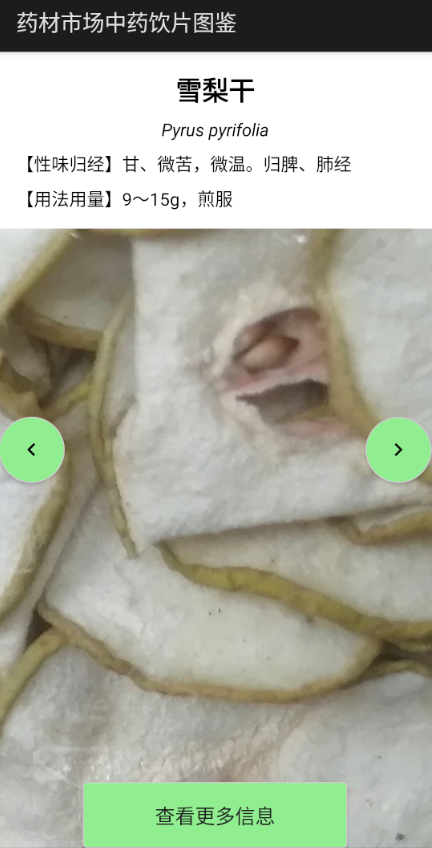

# 药材市场中药饮片图鉴

这是一个使用 C# 原生安卓开发模板编写的简易版中药材图鉴手机应用程序，取材于广州市荔湾区清平中药材专业市场（药材照片于2024年6月份实地拍摄），由仲恺农生院21级中草药毛同学作为业余项目开发，旨在为用户提供简便的中药材查询和学习工具，通过该应用轻松查看各种中药材的详细信息，包括图片、名称、拉丁学名、性味归经、用法用量等。

## 功能特点

* **药材展示** ：该应用程序的主页面包含十几种药材，每种药材照片清晰度较高，方便用户直观认识和辨别。
* **主页面导航** ：通过主页面的“<”“>”按钮，用户可以在不同的药材信息之间切换浏览。
* **详细信息** ：点击“查看更多信息”按钮，可查看药材的详细介绍，包括功效、药理作用、采集加工、性味、归经、用法用量、注意事项等全面的资料。

## 技术实现

该项目使用 C# 语言开发，基于 .NET MAUI 工作负荷当中的 __原生安卓应用__ 框架，利用 Android 的 UI 组件（如 ImageView、TextView、Button 等）构建应用界面，通过 WebView 加载和展示中药材的详细信息 HTML 文件。

## 使用方法

### 下载或克隆项目

直接在本页面下载源代码，或使用 Git 克隆项目到本地：
* `git clone <项目仓库地址>`

### 配置环境

确保已安装以下开发环境：
* Visual Studio 2022 或以上版本
* .NET MAUI 或 Xamarin.Android 工作负荷
* Android SDK 和相关构建工具

### 编译运行

1. 在 Visual Studio 中打开项目解决方案文件（.sln）。
2. 选择合适的 Android 模拟器或连接物理设备。
3. 点击 “生成” 菜单，选择 “生成解决方案” 来编译项目。
4. 点击 “调试” 菜单，选择 “开始调试” 来运行应用。

## 项目贡献

如果你对本项目感兴趣并希望进行贡献，可以通过以下方式参与：

1. **提交代码** ：修复漏洞、添加新功能或改进现有功能后，可以将更改提交到项目的仓库中。在提交前，请确保已经阅读并遵守项目的贡献指南和代码风格规范。
2. **报告问题** ：如果在使用过程中发现任何问题或有改进建议，可以在项目的 “Issues” 页面提交问题报告。请尽可能详细地描述问题的现象、重现步骤等信息，以便开发者能够更好地理解和解决。

## 联系方式

如果你有任何问题或建议，可以通过以下方式联系我：

* 作者邮箱：benjamin_2001@qq.com
* 项目 GitHub 地址：https://github.com/<用户名>/<项目仓库名>